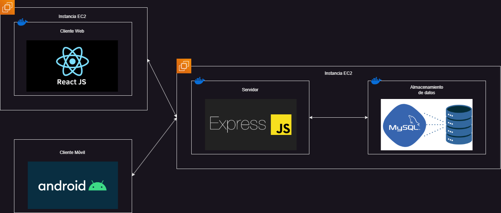

# HERRAMIENTAS USADAS
## Backend
* Node: `v20.17.0`
* Express: `v4.19.2`

## Frontend
* Node: `v20.17.0`
* React: `v18.3.1`
* ### Aplicación Móvil
    *   Android-API LEVEL: 26
## Almacenamiento de Datos
* MYSQL: `v8.0`

## Contendores
* Docker: `v27.1.2`
* Docker Compose: `v2.29.1`

## SISTEMA

